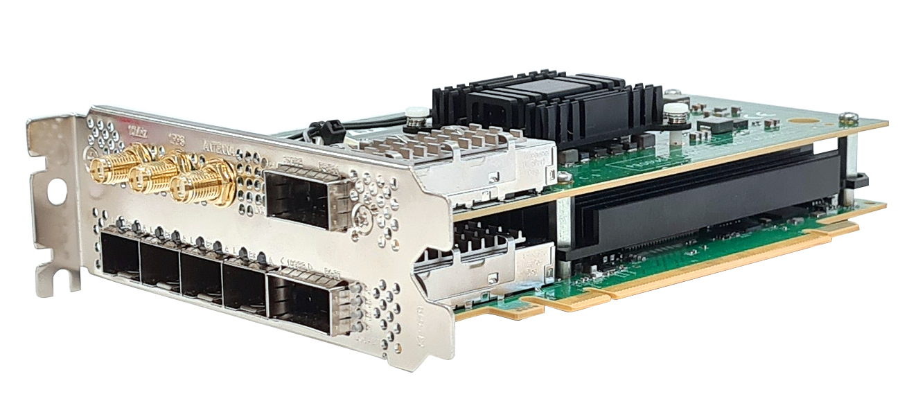
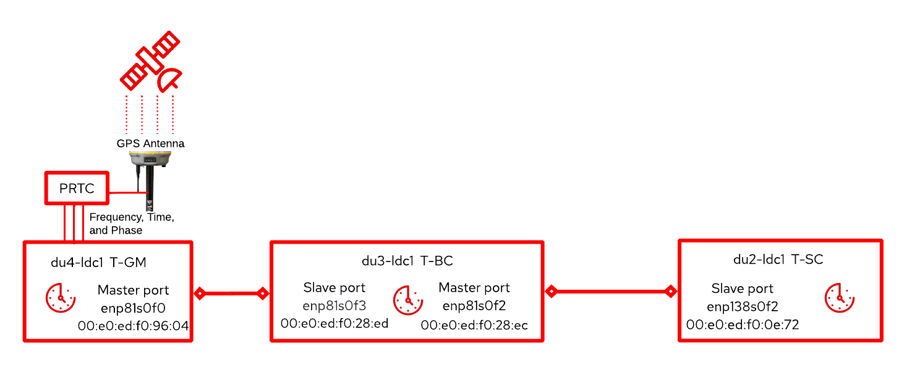
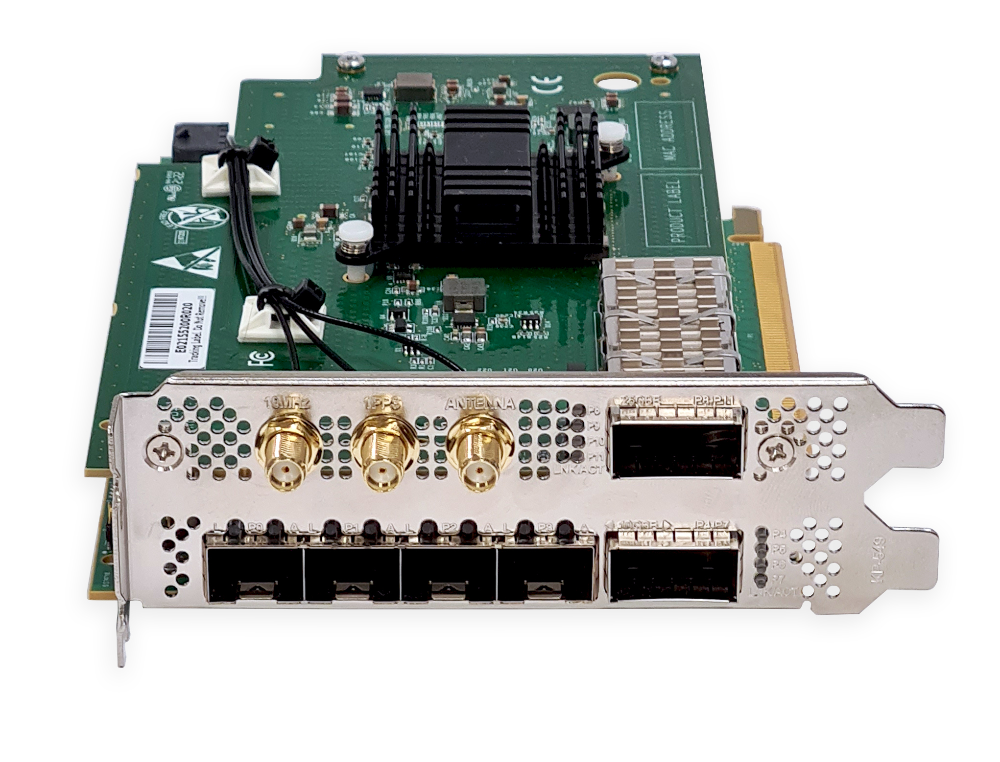
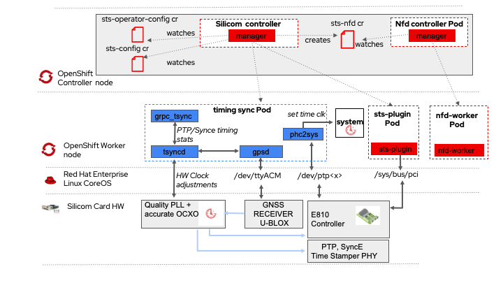

# Silicom Time Sync (STS) Operator on OpenShift

Are you working with baremetal clusters and looking for a timing and synchronization solution for your containerized workloads? The Silicom Time Sync (STS) Operator was just released as a [Certified Operator on OpenShift][4].

Synchronization and precise timing via Global Positioning Systems (GPS) is of paramount importance for 5G [Open Radio Access Networks (O-RAN)][5]. This blog shows how easy it is to install the STS Operator on Red Hat OpenShift Container Platform, and use it to configure specialized E810 NIC adapters from Silicom in OpenShift Container Platform. We'll also show how to configure the time synchronization functionality on a Telecom Grandmaster (T-GM) node in our cluster.

## Table of Contents

1. [Fundamentals of Synchronization for 5G O-RAN](#background)
2. [Pre-requisites](#pre-requisites)
3. [Target Synchronization Topology](#topology)
3. [Installing Silicom Time Sync Operator](#installation)
4. [Telecom Grandmaster Provisioning](#stsconfig)
6. [Telecom Grandmaster Operation](#stsops)
7. [Telecom Boundary Clock Provisioning](#stsconfigBCprov)
7. [Telecom Boundary Clock Operation](#stsconfigBCop)
8. [Telecom Ordinary Clock Provisioning](#stsconfigOCproc)
9. [Telecom Ordinary Clock Operation](#stsconfigOCop)
10. [Uninstalling Silicom Time Sync Operator](#uninstalling)
11. [Wrapup](#conclusion)


## Fundamentals of Synchronization for 5G Open Radio Access networks (O-RAN) <a name="background"></a>

5G O-RAN leverages sophisticated technologies to maximize achieved data rates. These techniques rely on tight synchronization between various elements of the 5G [Open Radio Access Network (O-RAN)][5]. Not getting timing right means mobile subscribers are likely to have a poor user experience. Typically this requires receivers of a Global Navigation Satellite Systems (GNSS), such as GPS. With a clear view of the sky, a GPS can receive signal from GNSS systems. From these signals, it can get the sources of frequency, phase, and time.


<figcaption class="figure-caption text-center">

**Figure 1** Precision Time Protocol clocks with Master and Slave Ports.

</figcaption>

In 5G O-RAN, multiple distributed network elements require getting frequency, time, and phase information. In a packet-based network, Precision Time Protocol (PTP), along with Synchronous Ethernet (SyncE), are prominently the dedicated protocols to carry such information required for achieving synchronization. The synchronization solution consists of the following elements:

- The recipient of the frequency, phase, and timing information derived from multiple GNSS signals in a PTP network is referred to as the Telecom Grandmaster (T-GM). The T-GM consumes the frequency, phase, and timing info from the GNSS receiver acting as Primary Reference Time Clock (PRTC) to calibrate its clock and distribute the frequency, phase, and time signal via PTP to its connected network elements lower in the synchronization hierarchy.

- The Telecom Time Slave Clock (T-TSC) functionality terminates the PTP protocol and recovers the clock from one or more master clocks.  As an example from O-RAN, an Open Remote Radio Unit (O-RRU) contains the slave functionality for its usage.

- The Telecom Boundary Clock (T-BC) combines both slave and master functions. At the slave side, it receives PTP packets from one or more master clocks, terminates the PTP, and recovers clock from the best master clock using the Best Master Clock Algorithm (BMCA). At the master side, new PTP sessions are created based on the timing information of the boundary clock. Information in PTP is then passed to the next boundary or slave clock in the chain.

T-BC, T-TSC, and T-GM functionality can be implemented using specific NICs with time synchronization support. [Silicom Time Sync (STS) NICs][1] contain Intel E810 NIC controllers and phase-locked loop (PLL)-based clocks, combined with an oscillator of high accuracy to comply with both PTP and SyncE to target O-RAN synchronization requirements in 5G systems.

## Pre-requisites <a name="pre-requisites"></a>

Before we proceed to install the Silicom Time Sync Operator, ensure that you have:

- A fresh cluster with [OpenShift Container Platform 4.10][6] installed. 

- Terminal environment with [oc][7] binary installed.

- A [certified Silicom Time Sync (STS) physical card][6]. For example, an [STS2][10] card physically installed in one of your baremetal worker nodes. Another STS physical card candidate could be [STS4][9] card.



<figcaption>

**Figure 2** Silicom Time Sync (STS) Card.

</figcaption>

- A GPS antenna with clear sight of the sky connected to the GNSS receiver of the STS card.

- [Authenticate as Cluster Admin inside your environment][11] in the OpenShift Cluster.

- Three worker nodes based on [SYS-210P][3] are used in this blog, but other server platforms that meet the PCIe Gen4 slot and height requirements should work. The worker nodes require:
  - Red Hat Enterprise Linux CoreOS in each of the three OpenShift worker nodes.
  - PCI-Express 4.0 x16 free slot in each of the three OpenShift worker nodes.
  - Default `chrony` time services daemon disabled in each of the three OpenShift worker nodes. In OpenShift 4.10 you can use post-installation Machine Config tasks as described [here][15].

- A container image with the following utilities installed: `lspci`, `ethtools`, and `lsusb`. This image will be used in the worker node equipped with STS card. The image can be pre-built and pushed into a container image registry such as [Red Hat Quay][13] or built locally as an ephemeral container.

## Target Synchronization Topology <a name="topology"></a>

In the picture below, we represent the aimed synchronization topology hierarchy. For the sake of demonstration, we include three worker nodes in a fresh Openshift 4.10 cluster: `du4-ldc1`, `du3-ldc1`, and `du2-ldc1`. 



<figcaption>

**Figure 3** Reference Synchronization Topology under evaluation.

</figcaption>

The goal is to configure worker node `du4-ldc1` as Grandmaster Clock, `du3-ldc1` as Boundary Clock, and `du2-ldc1` as Ordinary Clock according to the requirements defined by ITU-T G.8275.1 profile. According to the scenarios defined by G.8275.1 we can consider the topology depicted above a representative topology. 
  
## Install Silicom Time Sync Operator <a name="installation"></a>

There are two distinct type of entities the operator handles: one is the Silicom Time Sync physical card, and the other is the Silicom Time Sync software stack. The certified Operator dramatically simplifies the deployment, configuration, and management of the Silicom Time Sync physical cards and the Time Sync software.

#### Install Silicom Time Sync (STS) Card in Worker Nodes
Here we describe the steps to follow to install the STS Card in each of the three OpenShift worker nodes: 

1. Install the card in a PCI-Express 4.0 x16 slot inside a baremetal worker node.
2. Connect USB cable from uUSB in card to USB port in the baremetal worker node.
3. Connect GPS Antenna to the GPS Input of the STS card (see Figure below).



<figcaption>

**Figure 4** SubMiniature version A (SMA) Connector for GPS input receiver in Silicom Time Sync (STS) Card.

</figcaption>

4. Switch-on the baremetal worker node equipped with an STS card.
5. Launch debug pod in the baremetal worker node equipped with STS card (in this case the node name is `du4-ldc1`). Since we just want to do a few ephemeral interactive checks with the debug pod, we take a Fedora 36 image and install both `usbutils`, `ethtools`, and `pciutils`:

  ```console
  oc debug node/du4-ldc1 --image=quay.io/fedora/fedora:36-x86_64
  sh-5.1# dnf -y install ethtool usbutils pciutils
  ```

6. Two USB lines must be detected, the U-Blox GNSS receiver (Vendor IDs 1546) and the Silicom USB (Vendor ID 1373):

  ```console
   # lsusb -d 1546:
   Bus 004 Device 004: ID 1546:01a9 U-Blox AG u-blox GNSS receiver
   # lsusb -d 1374:
   Bus 004 Device 003: ID 1374:0001 Silicom Ltd. Tsync USB Device
  ```

7. Check that the Intel E810 Physical Functions (PFs) have been detected. In the case of an STS4 card a total of 12PFs must be detected:

  ```console
   # lspci -d 8086: | grep E810
   51:00.0 Ethernet controller: Intel Corporation Ethernet Controller E810-C for backplane (rev 02)
   51:00.1 Ethernet controller: Intel Corporation Ethernet Controller E810-C for backplane (rev 02)
   51:00.2 Ethernet controller: Intel Corporation Ethernet Controller E810-C for backplane (rev 02)
   51:00.3 Ethernet controller: Intel Corporation Ethernet Controller E810-C for backplane (rev 02)
   51:00.4 Ethernet controller: Intel Corporation Ethernet Controller E810-C for backplane (rev 02)
   51:00.5 Ethernet controller: Intel Corporation Ethernet Controller E810-C for backplane (rev 02)
   51:00.6 Ethernet controller: Intel Corporation Ethernet Controller E810-C for backplane (rev 02)
   51:00.7 Ethernet controller: Intel Corporation Ethernet Controller E810-C for backplane (rev 02)
   53:00.0 Ethernet controller: Intel Corporation Ethernet Controller E810-C for backplane (rev 02)
   53:00.1 Ethernet controller: Intel Corporation Ethernet Controller E810-C for backplane (rev 02)
   53:00.2 Ethernet controller: Intel Corporation Ethernet Controller E810-C for backplane (rev 02)
   53:00.3 Ethernet controller: Intel Corporation Ethernet Controller E810-C for backplane (rev 02)
  ```

8. Check that the firmware in the card must be greater or equal than 3.20, check the firmware version of the card by getting the NIC name (in this case `enp81s0f2`). If older firmware is detected (<= 3.20), contact Silicom to obtain updated firmware.  The interface name can be obtained from the PCI number (as showed above, in our case `51:00` is the PCI):

  ```console
  # ls  /sys/bus/pci/devices/0000\:51\:00.2/net
  enp81s0f2
  # ethtool -i enp81s0f2 | grep firmware
  firmware-version: 3.20 0x8000eb26 1.3146.0
  ```
9. For the case of the worker node acting as Grandmaster Clock, assure that the GPS input is getting proper GPS data:

  ```console
  # stty -F /dev/ttyACM0 raw
  # cat /dev/ttyACM0
  $GNVTG,,T,,M,0.000,N,0.000,K,A*3D
  $GNGGA,142033.00,3256.58402,N,09659.67042,W,1,12,99.99,169.1,M,-25.1,M,,*4D
  $GNGSA,A,3,09,16,27,04,07,14,21,01,51,30,08,46,99.99,99.99,99.99,1*33
  $GNGSA,A,3,83,72,73,85,74,84,65,71,,,,,99.99,99.99,99.99,2*3F
  $GNGSA,A,3,02,11,05,09,24,12,25,33,03,31,,,99.99,99.99,99.99,3*3E
  $GNGSA,A,3,,,,,,,,,,,,,99.99,99.99,99.99,4*34
  ```

### Install OpenShift Operators from the embedded OperatorHub

Now that the card has been properly installed and it is receiving proper GNSS data from GPS input, let's install the Silicom Time Sync Operator and its requirements in our OpenShift cluster.

#### Create namespace

We first create a namespace (e.g., silicom namespace) from the Web Console. Go to **Administration->Namespaces** and click
**Create Namespace**:

  * select *No additional labels* in **Labels**
  * select *No restrictions* in **Default network policy**


<figcaption>

**Figure 5** Create Namespace where Silicom Time Sync Operator will be located.

</figcaption>

#### Install Node Feature Discovery Operator

In OpenShift 4.10, we install the Node Feature Discovery Operator in the specific namespace where the Silicom Time Sync Operator will be installed, for instance `silicom` namespace. In the OpenShift 4.10 console:

  * select *stable* as **Update channel**
  * select *A specific namespace on the cluster* as **Installation mode**
  * select *silicom* namespace as **Installed Namespace**  
  * select *Automatic* as **Update approval**

#### Install Silicom Time Sync Operator
By means of the OpenShift Web Console, install the STS Operator in the `silicom` namespace:

  * select *stable* as **Update channel**
  * select *A specific namespace on the cluster* as **Installation mode**
  * select *silicom* namespace as **Installed Namespace**  
  * select *Automatic* as **Update approval**


<figcaption>

**Figure 5** Install Silicom Time Sync (STS) Operator.

</figcaption>

You can check through the CLI using `oc get csv` command the specific version and status of the installation:

```console
NAME                                 DISPLAY                           VERSION               REPLACES                  PHASE
silicom-sts-operator.v0.1.0          Silicom STS Operator              0.1.0                                           Succeeded
```

Once the operator is installed with the Custom Resource Definition (CRD)s exposed in the figure above, we proceed to instantiate the Custom Resources (CRs). Note that when you install an Operator you are not installing the software services managed by that Operator (in this case the Silicom Time Sync software stack). 

#### Install StsOperatorConfig CR

Create the StsOperatorConfig CR object to set the desired Silicom Time stack configuration. Apply the following CR:

```yaml
# cat <<EOF | oc apply -f -
apiVersion: sts.silicom.com/v1alpha1
kind: StsOperatorConfig
metadata:
  name: sts-operator-config
  namespace: silicom
spec:
  images:
EOF
```  
This will trigger the Operator to instantiate a Node Feature Discovery (NFD) Custom Resource (CR), which will detect worker nodes physically equipped with a STS card. This CR is consumed by the [`NFD Operator`][2]. Note, as described previously, that the STS Operator requires the presence of the [`NFD Operator`][2] watching for the NFD CRs that will be created by the STS Operator after the creation of an `StsOperatoConfig` CR.
Here we have one node with an STS card, thus the node should have been automatically labeled by NFD with `feature.node.kubernetes.io/custom-silicom.sts.devices=true`. We can check whether the aforementioned label is present in `du4-ldc1` node:

```console
# oc describe node du4-ldc1 | grep custom-silicom.sts.devices=true
                    feature.node.kubernetes.io/custom-silicom.sts.devices=true
```

After this, the STS Operator creates a daemonset called `sts-plugin` in those nodes labeled by NFD with `feature.node.kubernetes.io/custom-silicom.sts.devices=true`. This daemonset is in charge of maintaining the state of the STS cards (e.g., port status information).

## Telecom Grandmaster Provisioning <a name="stsconfig"></a>

Now we proceed to configure the baremetal worker node `du4-ldc1` as Telecom Grandmaster (T-GM).

### Label Grandmaster Node

Add a node label `sts.silicom.com/config=gm-1` in the worker node with GPS cable connected to the Silicom Time Sync card. In our case our baremetal worker node name is `du4-ldc1`:

```console
# oc label node du4-ldc1 sts.silicom.com/config="gm-1"
```

### Instantiate StsConfig CR

Create a StsConfig CR object to provision the desired Telecom PTP profile [T-GM.8275.1][12] focused on phase/timing synchronization with full timing support from the network.
Note in the StsConfig below the field `nodeSelector` to constrain the nodes in the cluster where to provision the Telecom PTP profile to those nodes labelled with `sts.silicom.com/config=gm-1`.

```yaml
# cat <<EOF | oc apply -f -
apiVersion: sts.silicom.com/v1alpha1
kind: StsConfig
metadata:
  name: gm-1
  namespace: silicom
spec:
  namespace: silicom
  imageRegistry: quay.io/silicom
  nodeSelector:
    sts.silicom.com/config: "gm-1"
  mode: T-GM.8275.1
  twoStep: 0                         # <-- One-Step PTP timestamping mode (requires PTP HW Timestamp) 
  esmcMode: 2                        # <-- set ESMC mode to auto
  ssmMode: 1                         # <-- set SSM Mode configured to SSM code
  forwardable: 1
  synceRecClkPort: 3
  syncOption: 1                      # <-- Europe Synchronization network option
  gnssSpec:
    gnssSigGpsEn: 1
  interfaces:
    - ethName: enp81s0f2
      holdoff: 500                   # <-- SyncE Hold-off timer set to 500msec
      synce: 1                       # <-- Enable SyncE
      mode: Master
      ethPort: 3
      qlEnable: 1                    # <-- ESMC Quality Level (QL) Enabled
      ql: 2                          # <-- ESMC Quality Level (QL) set to PRTC
EOF                 
```

* For a full listing of the possible Silicom Time Sync configuration parameters and their possible values in `StsConfig` CR:

``` console
# oc explain StsConfig.spec
```

* Also, for a full listing of possible Gnss configuration parameters and values in `gnssSpec` field within `StsConfig` CR:

```console
# oc explain StsConfig.spec.gnssSpec
```

After deploying the StsConfig CR, check for the new pod in the `silicom` namespace:

```console
# oc get pods -n silicom | grep gm-1         
gm-1-du4-ldc1-tsync-zqkh6                 4/4     Running   0             4h
```

The pod showed above includes the timing solution for T-GM clock functionality. As can be observed, the pod is composed by four containers. The diagram below illustrates the resulting Silicom Time Sync software deployment based on one pod composed by four containers in the OpenShift worker node equipped with an STS card.



<figcaption>

**Figure 7** Deployment of a T-GM in an OpenShift worker node equipped with an STS card.

</figcaption>

As showed in the Figure above, the STSConfig CR instance triggers the creation of the following containers via the Silicom controller pod:

- `tsyncd` is the main PTP and Ethernet Synchronization Message Channel (ESMC) daemon, and it is also in charge of managing the synchronization paths on the physical card underneath, e.g., from GNSS (controlled by the gpsd container as detailed below) to the main system clock, and from main system clock to the E810 PTP Hardware Clock (PHC).

- `grpc_tsync`: exposes the timing synchronization API to get various type of synchronization-related info, subscribe to receiving notification events, and even allowing the configuration of timing parameters.

- `gpsd` container reads and distributes the timing/phase/frequency information gathered from the GNSS receiver.

- `phc2sys` that aligns the worker node system clock to the PTP Hardware clock embedded in the STS card.


## Telecom Grandmaster Operation <a name="stsops"></a>

The Silicom Time Sync stack is deployed in our OpenShift worker node. Now how do we know it is synchronizing the Hardware Clock in the Silicom Time Sync card? It is easy. The timing synchronization software stack exposes an API based on gRPC to query timing status information.

1. We recommend first (if you haven't done it yet) to check that your STS card is receiving GPS timing and location data. We can do that by getting the logs of the `gpsd` container:

```console
# oc logs -f gm-1-du4-ldc1-tsync-fwcqq -c du4-ldc1-gpsd
gpsd:CLIENT: => client(0): {"class":"TPV","device":"/dev/ttyACM0","status":7,"mode":3,"time":"2022-09-15T15:44:56.000Z","leapseconds":18,"ept":0.005,"lat":32.943076500,"lon":-96.994498200,"altHAE":140.8500,"altMSL":165.9950,"alt":165.9950,"epx":4.807,"epy":5.113,"epv":0.676,"track":333.0466,"magtrack":336.1832,"magvar":3.1,"speed":0.000,"climb":-0.050,"eps":5.81,"epc":1.38,"geoidSep":-28.762,"eph":0.956,"sep":1899.810}
```

2. Execute a gRPC client in the container exposing the gRPC API. This command below launches gRPC client:

```console
# oc exec -it  gm-1-du4-ldc1-tsync-fwcqq -c du4-ldc1-grpc-tsyncd -- tsynctl_grpc
Tsynctl gRPC Client v1.1.3
```

3. You can now check the status of the GM clock in the Silicom Time Sync card. `LOCKED` state means that the Hardware Clock in the STS card is aligned to the received timing/phase information from the GNSS receiver:

```console
$ get_clk_class
Clock Class: 6, LOCKED
```

4. To check the status of the GNSS receiver:

```console
$ get_gnss_status 
GNSS Current Status:
====================
    GNSS satellites visible:      36
    GNSS satellites used:         30
    GNSS Type of Fix:             5 - Time-only fix
    Survey-in validity flag:      valid
    Survey-in progress flag:      0
    GNSS 1PPS error monitor:      within limits
    Time Accuracy Estimate:       2
    Noise Level L1:               83
    AGC Monitor L1:               4914 (60.0%)
    CW jamming indicator L1:      6 (2.4%)
    CW jamming state L1:          unknown
    Noise Level L2:               47
    AGC Monitor L2:               6318 (77.1%)
    CW jamming indicator L2:      21 (8.2%)
    CW jamming state L2:          unknown
    GNSS cable state:             connected
    GNSS latitude:                329430694
    GNSS longitude:               3325022308
    GNSS height:                  140648
    Spoofing detection state:     no spoofing indicated
```
Note the importance of attaining `GNSS Type of Fix: 5 - Time-only fix`. The GNSS fix type determines the technique used by the GPS receiver to calculate location and timing information. A value of 5 indicates a time-only fix. This is the case where the receiver is only used for solving time. Time-only fix is a requirement for Silicom Time Synchronization solution to get PTP HW clock of the T-GM card in a Locked status. 

5. For additional info type `help` at the `tsynctl_grpc` prompt:

```console
$ help
...REDACTED...
Timing Info:
============
register          [params] - Registration for Timing Commands

deregister        [params] - Deregistration for Timing Commands

get_timing_status [params] - Get Timing status (requires registration)

get_timing_stats  [params] - Get Timing statistics (requires registration)

    Timing Parameters List (all mandatory):
    =======================================
    Micro Service ID
    Micro Service Instance
    Application ID
    vDU baseband ID
    Remote Application ID
...REDACTED...
```

6. Register the gRPC client first via `register` command (register and deregister are commands to get access for Timing Info/ Timing Config related commands, contact [Silicom](mailto:support@silicom-usa.com) for further information):

```console
$ register 1 2 3 4 5
msId:           1
msInstance:     2
appId:          3
basebandId:     4
remoteAppId:    5
```

7. Once the gRPC client is registered, it can call any timing commands with the registered set of parameters (contact [Silicom](mailto:support@silicom-usa.com) for further information):

```console
$ get_timing_status 1 2 3 4 5
Please wait...

msId:           1
msInstance:     2
appId:          3
basebandId:     4

Timing Status:
==============
Clock Mode:             GM Clock

Clock Status:
=============
Sync Status:            Locked
PTP Lock Status:        Unknown
Synce Lock Status:      Unknown
Sync Failure Cause:     N/A

PTP Data:
=========
Profile:                G_8275_1
GM Clock ID:            00:E0:ED:FF:FE:F0:96:04
Parent Clock ID:        00:E0:ED:FF:FE:F0:96:04
Configured Clock Class: 248
Received Clock Class:   6
PTP Interface 1:        enp81s0f0
PTP Port 1 Role:        Unknown
...REDACTED...
SyncE Data:
===========
SyncE Interface:        according to T-GM series SyncE Port Bit Mask value in tsyncd.conf file
Clock Quality:          2

GNSS Data:
==========
Number of satellites:   30
GNSS Fix Type:          5
GNSS Fix Validity:      true
GNSS Latitude:          329430765
GNSS Longitude:         3325022314
GNSS Height:            140850
```

## Telecom Boundary Clock Provisioning <a name="stsconfigBCprov"></a>

Now we proceed to configure the baremetal worker node `du3-ldc1` as Telecom Bounday clock (T-BC).

### Label Boundary Clock Node

Add a node label `sts.silicom.com/config=bc-1` in the worker node with a Silicom Time Sync card. In our case our baremetal worker node name is `du3-ldc1`:

```console
# oc label node du3-ldc1 sts.silicom.com/config="bc-1"
```

### Instantiate StsConfig CR

Create a StsConfig CR object to provision the desired Telecom PTP profile [T-GM.8275.1][12] focused on phase/timing and frequency synchronization (SyncE is enabled) with full timing support from the network.
Note in the StsConfig below the field `nodeSelector` to constrain the nodes in the cluster where to provision the Telecom PTP profile to those nodes labelled with `sts.silicom.com/config=bc-1`.

```yaml
# cat <<EOF | oc apply -f -
apiVersion: sts.silicom.com/v1alpha1
kind: StsConfig
metadata:
  name: bc-1
  namespace: silicom
spec:
  namespace: silicom
  imageRegistry: quay.io/silicom
  nodeSelector:
    sts.silicom.com/config: "bc-1"
  mode: T-BC-8275.1
  twoStep: 0                           # <-- One-Step PTP timestamping mode (requires PTP HW Timestamp)
  esmcMode: 2                          # <-- set ESMC Mode to auto
  ssmMode: 1                           # <-- set SSM Mode to SSM Code
  forwardable: 1
  synceRecClkPort: 4
  syncOption: 1                        # <-- Europe Synchronization Network Option
  gnssSpec:
    gnssSigGpsEn: 0                    # <-- GPS Disabled
  interfaces:
    - ethName: enp81s0f3
      synce: 1                         # <-- Enable SyncE 
      holdoff: 500                     # <-- SyncE Hold-off timer set to 500msec
      mode: Slave                      
      ethPort: 4 
      qlEnable: 1                      # <-- QL Enabled
      ql: 4                            # <-- ESMC Quality Level (QL) set to DNU (Do Not Use)
    - ethName: enp81s0f2
      synce: 1
      holdoff: 500
      mode: Master                    
      ethPort: 3
      qlEnable: 1                     # <-- ESMC Quality Level Enabled
      ql: 2                           # <-- ESMC Quality Level (QL) set to PRTC 
EOF
```
Note here that `enp81s0f3` is configured as a Slave port, whereas `enp81s0f2` interface is configured as master port to feed phase/time and frequency to other nodes in the synchronization hierarchy. These nodes can be either Boundary Clocks or Ordinary Clocks.

## Telecom Boundary Clock Operation <a name="stsconfigBCop"></a>

The Silicom Time Sync stack is deployed in our OpenShift worker node acting as boundary clock role. As we did before we can use the gRPC to check the timing status information:

```console
# oc get pods -n silicom | grep bc-1         
bc-1-du3-ldc1-tsync-rxh2w      4/4     Running   0             1h

# oc exec -it bc-1-du3-ldc1-tsync-rxh2w -n silicom -c du3-ldc1-grpc-tsyncd  -- tsynctl_grpc
Tsynctl gRPC Client v1.1.3
$ register 1 2 3 4 5
...REDACTED...
$ get_timing_status 1 2 3 4 5
Please wait...

msId:                    1
msInstance:              2
appId:                   3
basebandId:              4

Timing Status:
==============
Clock Mode:              BC Clock

Clock Status:
=============
Sync Status:             Locked
PTP Lock Status:         Locked
Synce Lock Status:       Locked
Sync Failure Cause:      N/A

PTP Data:
=========
Profile:                 G_8275_1
GM Clock ID:             00:E0:ED:FF:FE:F0:96:04
Parent Clock ID:         00:E0:ED:FF:FE:F0:96:04
Configured Clock Class:  248
Received Clock Class:    6
PTP Interface 1:    
PTP Port 1 Role:         Master
PTP Interface 2:    
PTP Port 2 Role:         Master
PTP Interface 3:         enp81s0f2
PTP Port 3 Role:         Master
PTP Interface 4:         enp81s0f3
PTP Port 4 Role:         Slave
...REDACTED...
SyncE Data:
===========
SyncE Interface:         enp81s0f3
Clock Quality:           1
GNSS Data:
==========
Number of satellites:    0
GNSS Fix Type:           0
GNSS Fix Validity:       false
GNSS Latitude:           0
GNSS Longitude:          0
GNSS Height:             0
```

## Telecom Ordinary Clock Provisioning <a name="stsconfigOCprov"></a>

Now we proceed to configure the baremetal worker node `du4-ldc1` as Telecom Ordinary Clock (T-OC).

### Label Ordinary Clock Node

Add a node label `sts.silicom.com/config=oc-1` in the worker node with a Silicom Time Sync card. In our case our baremetal worker node name is `du2-ldc1`:

```console
# oc label node du2-ldc1 sts.silicom.com/config="oc-1"
```

### Instantiate Ordinary Clock Node

Create a StsConfig CR object to provision the desired Telecom PTP profile [T-GM.8275.1][12] focused on ending the synchronization chain for both PTP and SyncE protocols. Note again the use `nodeSelector` to constrain the worker nodes to those nodes labelled with `sts.silicom.com/config=oc-1`.

```yaml
# cat <<EOF | oc apply -f -
apiVersion: sts.silicom.com/v1alpha1
kind: StsConfig
metadata:
  name: oc-1
  namespace: silicom
spec:
  namespace: silicom
  imageRegistry: quay.io/silicom
  nodeSelector:
    sts.silicom.com/config: "oc-1"
  mode: T-TSC.8275.1                 
  twoStep: 0                          # <-- One-Step PTP timestamping mode
  esmcMode: 2                         # <-- ESMC Mode set to Auto
  ssmMode: 1                          # <-- Mode is SSSM Code
  forwardable: 1
  syncRecClkPort: 3
  syncOption: 1                       # <-- Europe Sync Option
  gnssSpec:
    gnssSigGpsEn: 0                   # <-- GPS Disabled
  interfaces:
    - ethName: enp138s0f2
      holdoff: 500                    # <-- SyncE Hold-off timer set to 500msec
      synce: 1                        # <-- Enable SyncE for frequency synchronization
      mode: Slave                     # <-- Port Mode
      ethPort: 3
      qlEnable: 1                     # <-- ESMC Quality Level (QL) Enabled
      ql: 4                           # <-- Quality Level value set to DNU (Do Not Use)
```

## Telecom Ordinary Clock Operation <a name="stsconfigOCop"></a>

The Silicom Time Sync stack is deployed in our OpenShift worker node acting as an Ordinary Clock. As we did before we can use the gRPC to check the timing status information:

```console
# oc get pods -n silicom | grep oc-1
oc-1-du2-ldc1-tsync-bkqn9                 4/4     Running   0         1h

# oc exec -it oc-1-du2-ldc1-tsync-bkqn9 -n silicom -c du2-ldc1-grpc-tsyncd  -- tsynctl_grpc
Tsynctl gRPC Client v1.1.3
$ register 1 1 1 1 1
...REDACTED...
$ get_timing_status 1 1 1 1 1
Please wait...

Timing Status:
==============
Clock Mode:           Slave Clock

Clock Status:
=============
Sync Status:          Locked
PTP Lock Status:      Locked
Synce Lock Status:    Locked
Sync Failure Cause:   N/A

PTP Data:
=========
Profile:                G_8275_1
GM Clock ID:            00:E0:ED:FF:FE:F0:96:04
Parent Clock ID:        00:E0:ED:FF:FE:F0:96:04
Configured Clock Class: 255
Received Clock Class:   6
PTP Interface 1:    
PTP Port 1 Role:        Slave
PTP Interface 2:    
PTP Port 2 Role:        Slave
PTP Interface 3:        enp138s0f2
...REDACTED...
SyncE Data:
===========
SyncE Interface:        enp138s0f2
Clock Quality:          1
...REDACTED...
```

## Uninstalling the Silicom STS Operator from the embedded OperatorHub <a name="uninstalling"></a>


Note that if you directly delete the operator the time synchronization pod will still be deployed and working in the three worker nodes. This is common among Operators in general to prevent a data loss situation, or outages in case the operator is uninstalled unintentionally. This policy is of special interest in our case, as the time synchronization is a critical service to keep active in 5G deployments. To fully uninstall the Silicom Time Sync stack, you should:

* First delete the `StsConfig` and `StsOperatorConfig` CRs we created before:

```console
# oc delete stsconfig gm-1 bc-1 oc-1 -n silicom
# oc delete stsoperatorconfig sts-operator-config -n silicom
```

* Now, uninstalling the Operator can be done from the OperatorHub console in your OpenShift cluster.


<figcaption>

**Figure 8** Uninstall the Silicom Time Sync Operator.

</figcaption>


## Wrap-up <a name="conclusion"></a>
This post provided a detailed walk through of the installation, operation and un-installation of the recently released [certified Silicom Time Sync Operator][4] for 5G synchronization in O-RAN deployments. By taking care of low-level hardware, this Operator does a really good job abstracting details of managing both the Hardware NIC and PTP/SyncE Software Synchronization protocols, so that the OpenShift Container Platform administrator does not have to be an expert in 5G synchronization and O-RAN. 

## Acknowledgements

Special thanks to the following individuals for their feedback in the authoring of this blog:
- Dave Cain, Senior Principal Engineer, Red Hat.
- Ryan Raasch, Senior Software Engineer, Silicom.
- Eyal Cohen, Director of Business Development, Silicom.


[1]: https://www.silicom-usa.com/pr/server-adapters/networking-adapters/25-gigabit-ethernet-networking-server-adapters/p425g410g8ts81-timesync-card-sts4/
[2]: https://docs.openshift.com/container-platform/4.10/hardware_enablement/psap-node-feature-discovery-operator.html
[3]: https://smicro.eu/supermicro-sys-210p-frdn6t-1
[4]: https://catalog.redhat.com/software/operators/detail/622b5609f8469c36ac475619
[5]: https://www.o-ran.org/
[6]: https://docs.openshift.com/container-platform/4.10/welcome/index.html
[7]: https://access.redhat.com/documentation/en-us/openshift_container_platform/4.9/html/cli_tools/openshift-cli-oc
[8]: https://catalog.redhat.com/hardware/search?p=1&c_catalog_channel=Component&q=silicom
[9]: https://www.silicom-usa.com/pr/server-adapters/networking-adapters/25-gigabit-ethernet-networking-server-adapters/p425g410g8ts81-timesync-card-sts4/#:~:text=Silicom's%20STS4%20TimeSync%20card%20capable,in%20Master%20and%20Slave%20mode
[10]: https://www.silicom-usa.com/pr/server-adapters/networking-adapters/10-gigabit-ethernet-networking-adapters/p410g8ts81-timesync-server-adapter/
[11]: https://access.redhat.com/documentation/en-us/openshift_container_platform/4.10/html/cli_tools/openshift-cli-oc#cli-logging-in_cli-developer-commands
[12]: https://www.itu.int/rec/T-REC-G.8275.1/recommendation.asp?lang=en&parent=T-REC-G.8275.1-202003-I
[13]: https://www.redhat.com/en/technologies/cloud-computing/quay
[14]: https://docs.openshift.com/container-platform/4.10/post_installation_configuration/machine-configuration-tasks.html