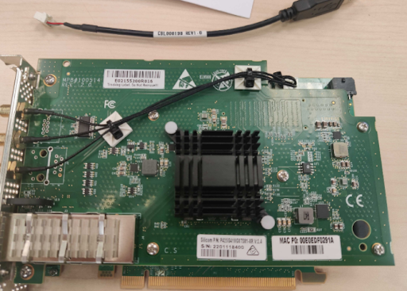
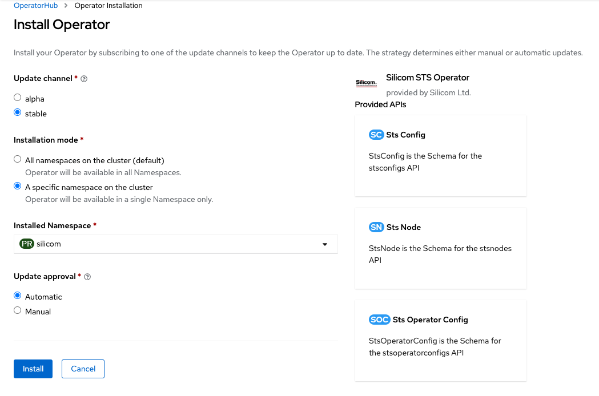
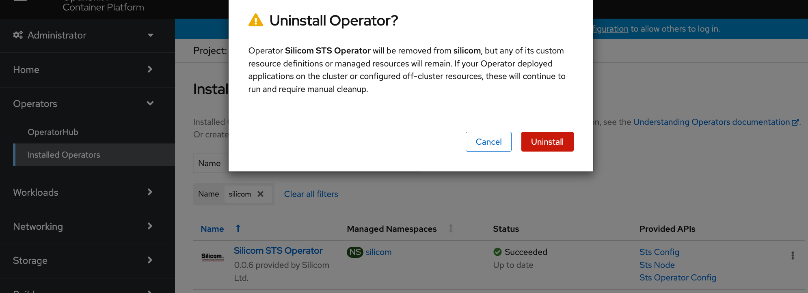

# Silicom TimeSync Operator on OpenShift
<!--
Red Hat® OpenShift® blah blah blah.
We want to publish a blog that contains a guided example of using the STS Operator on OpenShift. This should contain:

-   Operator Overview
-   Pictorial Overview of T-GM, T-BC, T-SC concepts
-   Operator Installation
-   Using T-GM
-->

Synchronization is of paramount importance for 5G-NR....Below are the steps to install the Silicom TimeSync Operator on Red Hat OpenShift. Towards the end of the installation, we will monitor the time synchronization functionalities on T-GM node.

## Table of Contents

1. [Fundamentals of Synchronization for 5G-NR](#background)
2. [Pre-requisites](#intro)
3. [Installing Silicom Timesync Operator](#installation)
4. [Telecom Grandmaster Provisioning](#stsconfig)
6. [Telecom Grandmaster Operation](#stsops)
7. [Uninstalling Silicom Timesync Operator](#uninstalling)
8. [Wrapup](#conclusion)
9. [References](#refs)

The term *Project* and *namespace* maybe used interchangeably in this guide.


## Fundamentals of Synchronization for 5G-NR <a name="background"></a>

5G-NR leverages of sophisticated technologies to maximize achieved data rates. These techniques rely on tight synchronization between various elements of the 5G Radio Access Network (RAN). Not getting timing right means mobile subscribers are likely to suffer a poor user experience. Typically, this requires receivers of a Global Navidation Satellite Systems (GNSS) such as GPS (see Figure). With a clear view of the sky, a GPS can get receive signal from satellites. From these signal it can get the sources of Frequency, Phase, and Time.


To transport such info to where it is needed over the network timing sync protocols are used. In a packet-based network Precision Time Protocol (PTP) along with Synchronous Ethernet (SyncE) are the protocols of choice to carry time information. The synchronization solution consists of the following elements:

- The recipient of the GNSS information in a PTP network is referred to as the grandmaster (GM) clock. The T-GM clock is conencted to the GNSS receiver and provides the source of time for the connected network elements lower in the synchronization hierarcy. 

- The slave functionality terminates the PTP protocol and tries to estimate the correct time from the master. An O-RRU contain the slave functionality and takes the time information from the slave for its usage.

- The boundary clock (BC) consists of both T-GM and T-SC functionalities. At the slave side, it receives PTP packet from the GM or another boundary clock, terminates the PTP, and estimates timing from the T-GM. At master side, a new PTP packet is created based on the timing information of the boundary clock and pass it to the next boundary or slave clock in the chain. 


T-BC, T-SC, and T-GM functionalities can be implemented using specific NICs with time synchronization support. [Silicom TimeSync NICs][2] are based on Intel E810 NIC controllers and servo PLL to support both PTP and SyncE for to target O-RAN synchronization requirements in 5G systems. In what follows, we present a step-by-step guide to use the Silicom operator to automate the installation, monitoring, and operation of Silicom Time Sync NICs as well as the TimeSync SW stack (i.e., the operands) in OpenShift.

## Pre-requisites <a name="pre-requisites"></a>

Before we proceed to the installation ensure you have:

- Terminal environment
  - Your terminal has the following commands
    - [oc](https://access.redhat.com/documentation/en-us/openshift_container_platform/4.9/html/cli_tools/openshift-cli-oc) binary.

- Physical card itself
  - A GPS antenna with clear sight of the sky connected to the GNSS receiver of the STS4/ST2 card.



- [Authenticate as Cluster Admin inside your environment](https://access.redhat.com/documentation/en-us/openshift_container_platform/4.9/html/cli_tools/openshift-cli-oc#cli-logging-in_cli-developer-commands) of an OpenShift 4.9 Cluster.

- OCP cluster with version bigger or equal than 4.8.29 with at least 1 baremetal worker node:

- Baremetal Worker Node Requirements
  - RHEL 8 with kernel version bigger or equal than 4.18.0-305.34.2.el8_4.x86_64
  - PCI-Express 4.0 x16 free slot

- [Node Feature Discovery][3] installed in the same namespace as the Silicom TimeSync Operator

## Installing Silicom Timesync Operator <a name="installation"></a>

There are two Operands to manage: one is the Silicom TimeSync cards and the other is the TimeSync sw stack. The operator dramatically simplifies the configuration and management of the Silicom TimeSync NICs and the TimeSync software.

#### Install Silicom Card in Worker

- Install the card in a PCI-Express 4.0 x16 slot 

- Connect GPS Antenna to the RF Input of the STS4 card

- Connect USB cable from uUSB in card to USB port in worker node and switch-on the worker node 

- Two USB lines must be detected, the U-Blox GNSS receiver (Vendor IDs 1546) and the Silicom propietary USB (Vendor ID 1373):
  
  ```console
   # lsusb -d 1546:
   Bus 004 Device 004: ID 1546:01a9 U-Blox AG u-blox GNSS receiver
   # lsusb -d 1374:
   Bus 004 Device 003: ID 1374:0001 Silicom Ltd. Tsync USB Device
  ``` 
- View that the Silicom STS4 twelve ports have been detected:

  ```console
   # lspci -d 8086
   51:00.0 Ethernet controller: Intel Corporation Ethernet Controller E810-C for backplane (rev 02)
   51:00.1 Ethernet controller: Intel Corporation Ethernet Controller E810-C for backplane (rev 02)
   51:00.2 Ethernet controller: Intel Corporation Ethernet Controller E810-C for backplane (rev 02)
   51:00.3 Ethernet controller: Intel Corporation Ethernet Controller E810-C for backplane (rev 02)
   51:00.4 Ethernet controller: Intel Corporation Ethernet Controller E810-C for backplane (rev 02)
   51:00.5 Ethernet controller: Intel Corporation Ethernet Controller E810-C for backplane (rev 02)
   51:00.6 Ethernet controller: Intel Corporation Ethernet Controller E810-C for backplane (rev 02)
   51:00.7 Ethernet controller: Intel Corporation Ethernet Controller E810-C for backplane (rev 02)
   53:00.0 Ethernet controller: Intel Corporation Ethernet Controller E810-C for backplane (rev 02)
   53:00.1 Ethernet controller: Intel Corporation Ethernet Controller E810-C for backplane (rev 02)
   53:00.2 Ethernet controller: Intel Corporation Ethernet Controller E810-C for backplane (rev 02)
   53:00.3 Ethernet controller: Intel Corporation Ethernet Controller E810-C for backplane (rev 02) 
  ```

#### Time Sync Stack 

Now that the card has been installed, we proceed to the installation of the operator that will be in charge of configuring the Synchronization aspects supported by that card. Note that you can perform the installation of the operator by using the command line.

### Install Operator from the embedded OperatorHub

<!-- Install steps clearly defined on a FRESH CLUSTER with output-->
<!-- 
      - Supported: NFD + SRO MUST be installed in the same namespace as Silicom Operator. The namespace can be selected and by default `openshift-silicom` will be created.
      - Unsupported: However we need the flexibility to select the namespace where the three operators will be located. Next version: 
          * NFD, SRO and Silicom can live in their own namespaces
          * Silicom operand should live in a different namespace than silicom operator.
-->
1. We are going to use the namespace we create to install the operator from the OperatorHub and bind an operatorGroup to that object too.  We select the namespace from the operatorhub console. However, note that to allow the installation in the selected namespace. NodeFeature Discovery operator should be preferably installed to automate the labelling of the nodes equipped with a Silicom Time Sync card. The current version requires NodeFeature Discovery to coexists in the same namespace as Silicom TimeSync operator.
* select No additional labels  
* select `No restrictions' in Default network policy.
<!--it is required that i) the operator must be a member of an operatorgroup that selects one namespace (ownNamespace or singlenamespace).
      - Operator is considered to be a member of an operatorgroup if 1) CSV of the operator is installed in the same namespace as the operator group, 2) install mode in CSV support the namespaces targetted by the [operator group][1]
-->


2. Install operator. This operator requires to install the `Node Feature Discovery Operator` to run in the same namespace just created. Once you install the `Node Feature Discovery Operator` in `silicom` namespace we proceed to install silicom Time Sync operator.



  * select `alpha` Update channel 
  * select `A specific namespace on the cluster`
  * select `silicom` namespace as Installed Namespace  
  * select Update approval Automatic

<!--
* The only installation mode supported from the operatorhub is `for all namespaces in the cluster`: operator will be available in all Namespaces. This means that the namespaces this operator can watch are ALL.
The operator gets installed in namespace `openshift-silicom` by default or in the namespace specified by the OCP administrator.-->
At the end of this step the operator will be installed in namespace called `silicom`.


3. Provision StsOperatorConfig CR object to provision the desired timing stack configuration

```yaml
cat <<EOF | oc apply -f -
apiVersion: sts.silicom.com/v1alpha1
kind: StsOperatorConfig
metadata:
  name: sts-operator-config
  namespace: openshift-operators
spec:
  images:
    #artifacts composing silicom timing sync stack
    tsyncd: quay.io/silicom/tsyncd:2.1.1.0
    tsyncExtts: quay.io/silicom/tsync_extts:1.0.0 
    phcs2Sys: quay.io/silicom/phcs2sys:3.1.1
    grpcTsyncd: quay.io/silicom/grpc-tsyncd:2.1.1.0 
    stsPlugin: quay.io/silicom/sts-plugin:0.0.3
    gpsd: quay.io/silicom/gpsd:3.23.1
  grpcSvcPort: 50051
  gpsSvcPort: 2947
  sro:
    build: false
EOF
```  

<!-- ### Install from the CLI -->
<!-- Omit this step Install steps clearly defined on a FRESH CLUSTER with output-->

## Telecom Grandmaster Provisioning <a name="stsconfig"></a>

<!-- Show the user how to place the card in T-GM mode -->
* Supported: Currently, the administrator must manually set labels in the nodes to identify what worker nodes inside the OCP cluster can get the T-TGM.8275.1 role.
* Not supported: automated discovery of nodes that are directly connected to the GPS signal to add the proper label.

1. Add a node label `gm-1` in the worker node that has GPS cable connected to the (i.e., du3-ldc1).

```console
oc label node du3-ldc1 sts.silicom.com/config="gm-1" 
```

2. Create a StsConfig CR object to provision the desired Telecom PTP profile (i.e., T-GM.8275.1)

3. For a full listing of the possible configuration parameters and their possible values.

``` console
oc explain StsConfig.spec
```

* Gnss configuration explainations

``` console
oc explain StsConfig.spec.GnssSpec
```

```yaml
cat <<EOF | oc apply -f -
apiVersion: sts.silicom.com/v1alpha1
kind: StsConfig
metadata:
  name: gm-1
  namespace: openshift-operators
spec:
  namespace: openshift-operators
  imageRegistry: quay.io/silicom
  nodeSelector:
    sts.silicom.com/config: "gm-1"
  mode: T-GM.8275.1
  twoStep: 0
  esmcMode: 2
  ssmMode: 1
  forwardable: 1
  synceRecClkPort: 3
  syncOption: 1
  gnssSpec:
    gnssSigGpsEn: 1
  interfaces:
    - ethName: enp81s0f2
      holdoff: 500
      synce: 1
      mode: Master
      ethPort: 3
      qlEnable: 1
      ql: 2
EOF                 
```

3. Provision the timing stack in the node labelled as `sts.silicom./config: "gm-1"` 

* Unsupported: Creation of timing sync stack in a different namespace than the operator.

```console
gm-1-du3-ldc1-gpsd-964ch                  2/2     Running   0          49m
gm-1-du3-ldc1-phc2sys-6fv9k               1/1     Running   0          49m
gm-1-du3-ldc1-tsync-pkxwv                 2/2     Running   0          44m
```

* Pods above represent the timing solution for T-GM. Zooming into the pods show picture below with the resulting deployment in node du3-ldc1. 


<!--
mode: Telecom PTP profiles as defined by the ITU-T. T-GM.8275.1 PTP profile corresponds to the profile for the RAN fronthaul network. 
twoStep and forwardable are PTP parameters.
gnssSigGpsEn:
esmcMode, ssmMode, and synceRecClkPort
syncOption:
interfaces
-->

## Telecom Grandmaster Operation <a name="stsops"></a>

The timing stack is deployed but, how do we know it is synchronizing the clock in the Silicom network card?
The time sync stack exposes an API based on gRPC to query timing status information.

1. Let's execute a grpc client in the container exposing the gRPC API.

```console
oc exec -it gm-1-du3-ldc1-tsync-pkxwv -c du3-ldc1-grpc-tsyncd -- tsynctl_grpc 
Tsynctl gRPC Client v1.0.9
$
```

2. Check the status of the clock in the Silicom network card. Locked status is a good sympthon. We need to know to what primary reference time it has been locked to.

```console
$ get_clk_class 
Clock Class: 6, LOCKED
```

3. Check more privileged timing information status related to the clock, PTP, and SyncE.

```console
$ register 1 2 3 4 5
$ get_timing_status 1 2 3 4 5

Timing Status:
==============
Clock Mode:   GM Clock

Clock Status:
=============
Sync Status:    Locked
PTP Lock Status:  Locked
Synce Lock Status:  Locked
Sync Failure Cause: N/A

PTP Data:
=========
Profile:    G_8275_1
GM Clock ID:    00:E0:ED:FF:FE:F0:28:EC
Parent Clock ID:  00:E0:ED:FF:FE:F0:28:EC
Configured Clock Class: 248
Received Clock Class: 6
PTP Interface:    according to T-GM series Port Bit Mask value in tsyncd.conf file

SyncE Data:
===========
SyncE Interface:  according to T-GM series SyncE Port Bit Mask value in tsyncd.conf file
Clock Quality:    4

GNSS Data:
==========
Number of satellites: 31
GNSS Fix Type:    5
GNSS Fix Validity:  true
GNSS Latitude:    32.943067
GNSS Longitude:   -96.994507
GNSS Height:    143.924000
```


## Uninstalling Silicom Timesync Operator <a name="uninstalling"></a>

Show the user helpful output from the pods running on the node, log output from successful assocation with GPS coordinates, etc

### Uninstall from the embedded OperatorHub

<!-- Uninstall steps clearly defined on a FRESH CLUSTER with output-->
This step uninstalls the operator the operator. Uninstalling the operator implies uninstalling the controller



You will see how the time synchronization service is still active because CRs we previously proviviosned are still present. The CRDs instances  `StsNodes`, `StsOperatorConfig`, and `StsConfig` keep active the created GM role.

```console
$ oc get stsnodes du3-ldc1
.
.
gpsStatus:
.
.
 tsyncStatus:
  mode: PTP Master Mode
  status: Normal Status
```

Note that although the operator is no longer installed the time synchronization service is still detecting a gps device and the node is acting as mater node. This is of special interest since time synchronization is critical in the case 5G deployment.

<!--### Uninstall from the CLI Omit this part for the blogpost 
* Deleting the subscription and the csv does not delete nfd daemonset or the specialresource daemonsets or the silicom sts-plugin daemonset will not delete the CRs associated to the operator

* If we want to fully delete the set of elements created by the operator we need to delete the stsoperatorconfig CR. The action below will delete the stsoperatorconfig daemonset (i.e., the sts-plugin) and the nfd and sro deploment (if used). 
-->      

## Wrap-up <a name="stsconfig"></a>

## References <a name="refs"></a>

[1]: https://docs.openshift.com/container-platform/4.8/operators/understanding/olm/olm-understanding-operatorgroups.html#olm-operatorgroups-target-namespace_olm-understanding-operatorgroups
[2]: https://www.silicom-usa.com/pr/server-adapters/networking-adapters/25-gigabit-ethernet-networking-server-adapters/p425g410g8ts81-timesync-card-sts4/
[3]: https://docs.openshift.com/container-platform/4.9/hardware_enablement/psap-node-feature-discovery-operator.html
