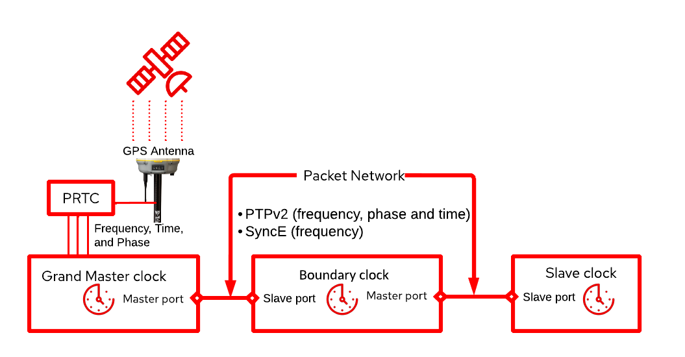
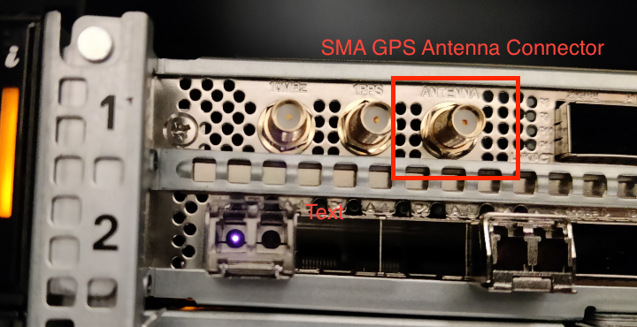
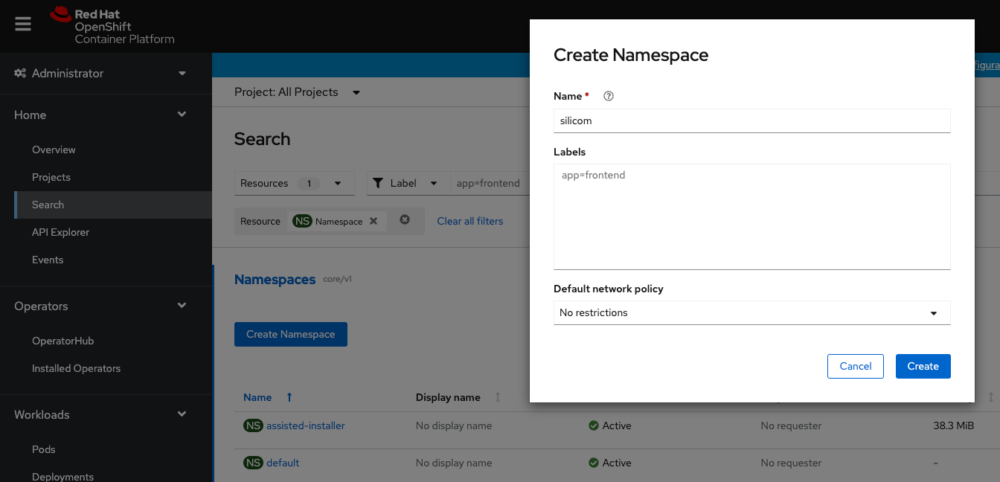
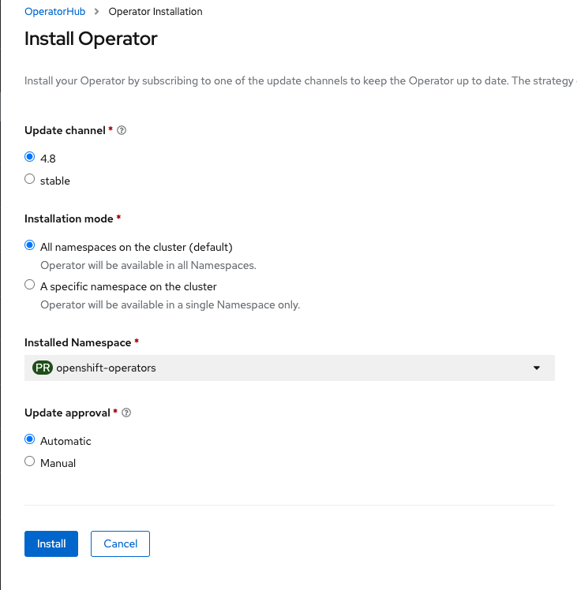
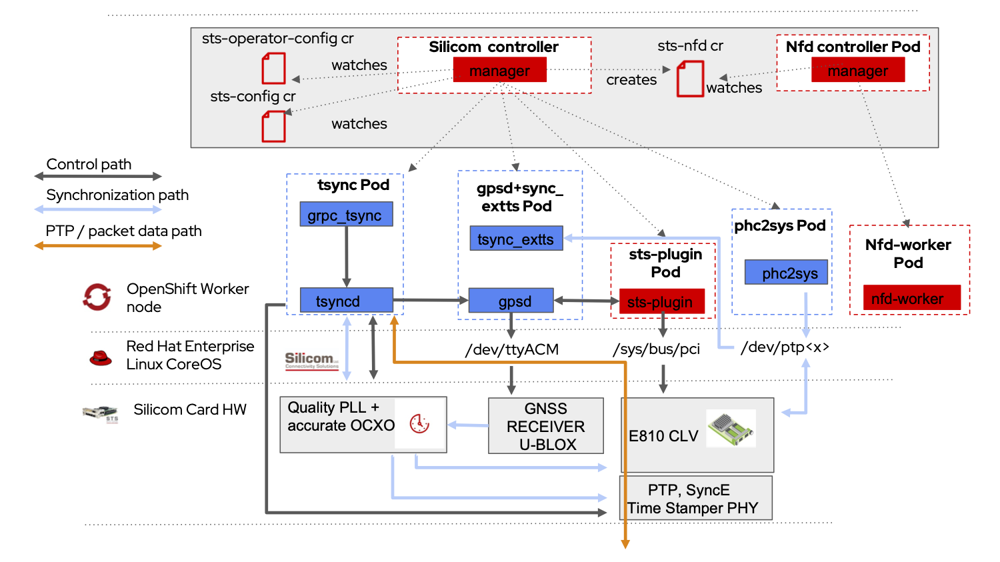

# Silicom Timing Synchronization (STS) Operator on OpenShift

Are you working with baremetal clusters and looking for a timing and synchronization solution for your containerized workloads? The Silicom Timing Synchronization (STS) Operator was just released as a [Certified Operator on OpenShift][5].

Synchronization and precise timing via Global Positioning Systems (GPS) is of paramount importance for 5G [Open Radio Access Networks (O-RAN)][6]. This blog shows how easy it is to install the STS Operator on Red Hat OpenShift Container Platform, and use it to configure specialized Columbiaville NIC adapters from Silicom in OpenShift Container Platform. Besides, we are going to show how to configure the time synchronization functionality on a Telecom Grand Master (T-GM) node.

## Table of Contents

1. [Fundamentals of Synchronization for 5G O-RAN](#background)
2. [Pre-requisites](#pre-requisites)
3. [Installing Silicom Timing Synchronization Operator](#installation)
4. [Telecom Grandmaster Provisioning](#stsconfig)
6. [Telecom Grandmaster Operation](#stsops)
7. [Uninstalling Silicom Timing Synchronization Operator](#uninstalling)
8. [Wrapup](#conclusion)


## Fundamentals of Synchronization for 5G Open Radio Access networks (O-RAN) <a name="background"></a>

5G O-RAN leverages sophisticated technologies to maximize achieved data rates. These techniques rely on tight synchronization between various elements of the 5G [Open Radio Access Network (O-RAN)][6]. Not getting timing right means mobile subscribers are likely to suffer a poor user experience. Typically, this requires receivers of a Global Navigation Satellite Systems (GNSS) such as GPS. With a clear view of the sky, a GPS can receive signal from GNSS systems. From these signals, it can get the sources of frequency, phase, and time.



<figcaption class="figure-caption text-center">

**Figure 1** Precision Time Protocol clocks with Master and Slave Ports.

</figcaption>

In 5G O-RAN, multiple distributed network elements require getting frequency, time, and phase information. In a packet-based network, Precision Time Protocol (PTP), along with Synchronous Ethernet (SyncE), are prominently the dedicated protocols to carry such information required for achieving synchronization. The synchronization solution consists of the following elements:

- The recipient of the GNSS information in a PTP network is referred to as the Telecom Grand Master (T-GM). The T-GM consumes the frequency, phase, and timing info from a Primary Reference Time Clock (PRTC) to calibrate its clock and distribute the frequency, phase, and time signal via PTP to its connected network elements lower in the synchronization hierarchy.

- The Telecom Time Slave Clock (T-TSC) functionality terminates the PTP protocol and recovers the clock from one or more master clocks. For instance, in O-RAN an Open Remote Radio Unit (O-RRU) contains the slave functionality for its usage.

- The Telecom Boundary Clock (T-BC) combines both slave and master functions. At the slave side, it receives PTP packets from, e.g., one or more master clocks, terminates the PTP, and recovers clock from the best master clock, using Best Master Clock Algorithm (BMCA). At master side, new PTP sessions are created based on the timing information of the boundary clock. Information in PTP is passed to the next boundary or slave clock in the chain.

T-BC, T-TSC, and T-GM functionality can be implemented using specific NICs with time synchronization support. [Silicom Timing Synchronization (STS) NICs][2] contain Intel E810 NIC (also known as Columbiaville) controllers and phase-locked loop (PLL)-based clocks, combined with an oscillator of high accuracy to comply with both PTP and SyncE to target O-RAN synchronization requirements in 5G systems.

## Pre-requisites <a name="pre-requisites"></a>

Before we proceed to the installation of the Silicom Timing Synchronization Operator ensure you have:

- [OpenShift Container Platform 4.8][7]. In particular, we used OpenShift 4.8.29 with at least 1 baremetal worker node.

- Terminal environment with [oc][8] binary installed.

- A [certified Silicom Timing Synchronization (STS) physical card][9]. In particular, either an [STS4][10], or an [STS2][11] card physically installed in one of your baremetal worker nodes.  


<figcaption>

**Figure 2** Silicom Timing Synchronization (STS) Card.

</figcaption>

- A GPS antenna with clear sight of the sky connected to the GNSS receiver of the STS card.

- [Authenticate as Cluster Admin inside your environment][12] in the OpenShift Cluster.

- Worker Node based on [SYS-210P][4] is used in this post, but other server platforms that meet the PCIe Gen4 slot and height requirements should work.
  - Red Hat Enterprise Linux CoreOS.
  - PCI-Express 4.0 x16 free slot in worker node.

- A container image with the following utilities installed: `lspci`, `ethtools`, and `lsusb`. This image will be used in the worker node equipped with STS card.


## Install Silicom Timing Synchronization Operator <a name="installation"></a>

There are two distinct type of entities the operator handles: one is the Silicom Timing Synchronization physical card, and the other is the Silicom Timing Synchronization software stack. The certified Operator dramatically simplifies the deployment, configuration, and management of the Silicom Timing Synchronization physical cards and the Timing Synchronization software.

#### Install Silicom Timing Synchronization (STS) Card in Worker

1. Install the card in a PCI-Express 4.0 x16 slot inside a baremetal worker node.
2. Connect USB cable from uUSB in card to USB port in worker node and switch-on the worker node.
3. Connect GPS Antenna to the GPS Input of the STS4 card (see Figure below).



<figcaption>

**Figure 3** SubMiniature version A (SMA) Connector for GPS input receiver in Silicom Timing Synchronization (STS) Card.

</figcaption>


4. Launch debug pod in worker node equipped with STS card. To overcome package limitations from UBI8, we use a Fedora 36 image so that we can install both `usbutils` and `pciutils`:

  ```console
  oc debug node/du3-ldc1 --image=quay.io/fedora/fedora:36-x86_64
  sh-5.1# dnf -y install ethtool usbutils pciutils
  ```

Two USB lines must be detected, the U-Blox GNSS receiver (Vendor IDs 1546) and the Silicom propietary USB (Vendor ID 1373):

  ```console
   # lsusb -d 1546:
   Bus 004 Device 004: ID 1546:01a9 U-Blox AG u-blox GNSS receiver
   # lsusb -d 1374:
   Bus 004 Device 003: ID 1374:0001 Silicom Ltd. Tsync USB Device
  ```

Check that the Intel E810 NIC has been detected:

  ```console
   # lspci -d 8086: | grep E810
   51:00.0 Ethernet controller: Intel Corporation Ethernet Controller E810-C for backplane (rev 02)
   51:00.1 Ethernet controller: Intel Corporation Ethernet Controller E810-C for backplane (rev 02)
   51:00.2 Ethernet controller: Intel Corporation Ethernet Controller E810-C for backplane (rev 02)
   51:00.3 Ethernet controller: Intel Corporation Ethernet Controller E810-C for backplane (rev 02)
   51:00.4 Ethernet controller: Intel Corporation Ethernet Controller E810-C for backplane (rev 02)
   51:00.5 Ethernet controller: Intel Corporation Ethernet Controller E810-C for backplane (rev 02)
   51:00.6 Ethernet controller: Intel Corporation Ethernet Controller E810-C for backplane (rev 02)
   51:00.7 Ethernet controller: Intel Corporation Ethernet Controller E810-C for backplane (rev 02)
   53:00.0 Ethernet controller: Intel Corporation Ethernet Controller E810-C for backplane (rev 02)
   53:00.1 Ethernet controller: Intel Corporation Ethernet Controller E810-C for backplane (rev 02)
   53:00.2 Ethernet controller: Intel Corporation Ethernet Controller E810-C for backplane (rev 02)
   53:00.3 Ethernet controller: Intel Corporation Ethernet Controller E810-C for backplane (rev 02)
  ```

The firmware in the card must be greater or equal than 3.10, check the firmware version of the card by getting the NIC name (in this case `enp81s0f2`). The interface name can be obtained from the PCI number (in our case `51:00` is the PCI):

  ```console
  # ls  /sys/bus/pci/devices/0000\:51\:00.2/net
  enp81s0f2
  # ethtool -i enp81s0f2 | grep firmware
  firmware-version: 3.10 0x8000d86d 1.3106.0
  ```
Assure that the GPS input is getting GPS data:

  ```console
  # stty -F /dev/ttyACM0 raw
  # cat /dev/ttyACM0
  $GNVTG,,T,,M,0.000,N,0.000,K,A*3D
  $GNGGA,142033.00,3256.58402,N,09659.67042,W,1,12,99.99,169.1,M,-25.1,M,,*4D
  $GNGSA,A,3,09,16,27,04,07,14,21,01,51,30,08,46,99.99,99.99,99.99,1*33
  $GNGSA,A,3,83,72,73,85,74,84,65,71,,,,,99.99,99.99,99.99,2*3F
  $GNGSA,A,3,02,11,05,09,24,12,25,33,03,31,,,99.99,99.99,99.99,3*3E
  $GNGSA,A,3,,,,,,,,,,,,,99.99,99.99,99.99,4*34
  ```


### Install Operators from the embedded OperatorHub

Now that the card has been installed, we proceed to installing the required Operators in our OpenShift cluster. These pieces of software will be in charge of configuring the Timing Synchronization aspects supported by the card.

#### Create namespace
We first create a namespace from the Web Console. Go to **Administration->Namespaces** and click
**Create Namespace**:

  * select *No additional labels* in **Labels**
  * select *No restrictions* in **Default network policy**



<figcaption>

**Figure 4** Create Namespace where Silicom Timing Synchronization Operator will be located.

</figcaption>

#### Install Node Feature Discovery Operator
We proceed to install the Node Feature Discovery Operator in the `silicom` namespace:

  * select *stable* as **Update channel**
  * select *A specific namespace on the cluster* as **Installation mode**
  * select *silicom* namespace as **Installed Namespace**  
  * select *Automatic* as **Update approval**



<figcaption>

**Figure 5** Install Node Feature Discovery (NFD) Operator.

</figcaption>

#### Install Silicom Timing Synchronization Operator
By means of the OpenShift Web Console, let's install the Silicom Timing Synchronization Operator in the `silicom` namespace:

  * select *alpha* as **Update channel**
  * select *A specific namespace on the cluster* as **Installation mode**
  * select *silicom* namespace as **Installed Namespace**  
  * select *Automatic* as **Update approval**


<figcaption>

**Figure 6** Install Silicom Timing Synchronization (STS) Operator.

</figcaption>

Once the Operator is installed with the Custom Resource Definition (CRD)s exposed in the figure above, we proceed to instantiate the Custom Resources (CRs). Note that when you install an Operator you are not installing the software services managed by that Operator (in this case the Silicom Timing Software stack).

#### Install StsOperatorConfig CR

Create the StsOperatorConfig CR object to set the desired timing stack configuration. Apply the following CR:

```yaml
# cat <<EOF | oc apply -f -
apiVersion: sts.silicom.com/v1alpha1
kind: StsOperatorConfig
metadata:
  name: sts-operator-config
  namespace: silicom
spec:
  images:
    tsyncd: quay.io/silicom/tsyncd:2.1.1.1
    tsyncExtts: quay.io/silicom/tsync_extts:1.0.0
    phcs2Sys: quay.io/silicom/phcs2sys:3.1.1
    grpcTsyncd: quay.io/silicom/grpc-tsyncd:2.1.1.1
    stsPlugin: quay.io/silicom/sts-plugin:0.0.6
    gpsd: quay.io/silicom/gpsd:3.23.1
  sro:
    build: false
EOF
```  
This will trigger the Operator to instantiate a Node Feature Discovery (NFD) Custom Resource (CR), which will detect worker nodes physically equipped with an Silicom Timing Synchronization card. This CR is consumed by the [`NFD Operator`][3]. Note that the Silicom Timing Synchronization Operator requires the presence [`NFD Operator`][3] in the same namespace. In this case, we have one node with an STS4 card, thus the node should have been automatically labeled by NFD with with `feature.node.kubernetes.io/custom-silicom.sts.devices=true`. We can check whether the aforementioned label is present in `du3-ldc1` node:

```console
# oc describe node du3-ldc1 | grep custom-silicom.sts.devices=true
                    feature.node.kubernetes.io/custom-silicom.sts.devices=true
```

After this, the Silicom Timing Synchronization Operator creates a daemonset called `sts-plugin` in those nodes labeled by NFD with `feature.node.kubernetes.io/custom-silicom.sts.devices=true`. This daemonset is in charge of maintaining the state of the STS cards configuration.

## Telecom Grandmaster Provisioning <a name="stsconfig"></a>

Now we proceed to configure the detected worker node `du3-ldc1` as Grandmaster.

### Label Grandmaster Node

Add a node label `gm-1` in the worker node that has GPS cable connected to the (i.e., in our case worker node named `du3-ldc1`).

```console
oc label node du3-ldc1 sts.silicom.com/config="gm-1"
```

### Instantiate StsConfig CR

Create a StsConfig CR object to provision the desired Telecom PTP profile [T-GM.8275.1][13] focused on phase/timing synchronization with full support from the network. 

```yaml
cat <<EOF | oc apply -f -
apiVersion: sts.silicom.com/v1alpha1
kind: StsConfig
metadata:
  name: gm-1
  namespace: silicom
spec:
  namespace: silicom
  imageRegistry: quay.io/silicom
  nodeSelector:
    sts.silicom.com/config: "gm-1"
  mode: T-GM.8275.1
  twoStep: 0
  esmcMode: 2
  ssmMode: 1
  forwardable: 1
  synceRecClkPort: 3
  syncOption: 1
  gnssSpec:
    gnssSigGpsEn: 1
  interfaces:
    - ethName: enp81s0f2
      holdoff: 500
      synce: 1
      mode: Master
      ethPort: 3
      qlEnable: 1
      ql: 2
EOF                 
```

* For a full listing of the possible Silicom Timing Synchronization configuration parameters and their possible values:

``` console
# oc explain StsConfig.spec
```

* For a full listing of possible Gnss configuration parameters:

```console
# oc explain StsConfig.spec.GnssSpec
```

After deploying the StsConfig CR, we can examine the set of pods present in `silicom` namespace:

```console
# oc get pods -n silicom          
gm-1-du3-ldc1-gpsd-b4v49                  2/2     Running   0          57s
gm-1-du3-ldc1-phc2sys-gss5c               1/1     Running   0          57s
gm-1-du3-ldc1-tsync-gmwl4                 2/2     Running   0          57s
nfd-controller-manager-b6c99794d-rj4q5    2/2     Running   0          3m31s
nfd-master-h47wb                          1/1     Running   0          2m40s
nfd-master-qfgj9                          1/1     Running   0          2m39s
nfd-master-rtcfs                          1/1     Running   0          2m40s
nfd-worker-4vprx                          1/1     Running   0          2m39s
sts-controller-manager-6b75cc8b45-mrd5c   2/2     Running   0          3m6s
sts-plugin-lpxlh                          1/1     Running   0          2m40s
```

The pods above represent the timing solution for T-GM of a node labeled `gm-1`. The diagram below illustrates the resulting Silicom Timing Synchronization stack deployment in the OpenShift worker node equipped with an STS card.



<figcaption>

**Figure 7** Deployment of a T-GM in an OpenShift worker node equipped with an STS card.

</figcaption>

As showed in the Figure above the STSConfig CR instance triggers the creation of the following containers via the Silicom controller pod:

- `tsyncd` in charge of aligning the PTP Hardware clock of the STS card to the timing/phase information received from `gpsd` container and distribute this information to other workloads or to other nodes lower in the synchronization hierarchy.

- `grpc_tsync`: exposes the timing synchronization API to get various type of synchronization-related info, subscribe to receiving notification events, and even allowing the configuration of timing parameters.

- `gpsd`: reads and distributes the timing/phase information gathered from the GPS receiver.

- `tsync_extts`, aligns the PTP Hardware clock to the external timing information gathered from the GPS receiver.


- `phc2sys` that aligns the worker node system clock to the PTP Hardware clock embedded in the STS card.


## Telecom Grandmaster Operation <a name="stsops"></a>

The timing stack is deployed in our OpenShift cluster, how do we know it is synchronizing the clock in the Silicom Timing Synchronization card? It is easy. The timing synchronization software stack exposes an API based on gRPC to query timing status information.

1. Execute a grpc client in the container exposing the gRPC API. This command below launches gRPC client:

```console
oc exec -it gm-1-du3-ldc1-tsync-pkxwv -c du3-ldc1-grpc-tsyncd -- tsynctl_grpc
Tsynctl gRPC Client v1.0.9
$
```
2. For additional info type `help` at the `tsynctl_grpc` prompt:

```console
$ help
.
.

Timing Info:
============
register    [params] - Registration for Timing Commands

deregister    [params] - Deregistration for Timing Commands

get_timing_status [params] - Get Timing status (requires registration)

get_timing_stats  [params] - Get Timing statistics (requires registration)

    Timing Parameters List (all mandatory):
    =======================================
    Micro Service ID
    Micro Service Instance
    Application ID
    vDU baseband ID
    Remote Application ID
.
.
```

3. Check the status of the GM clock in the Silicom network card: 

```console
$ get_clk_class
Clock Class: 6, LOCKED
```

4. If we want to gather more detailed timing information status and PTP,SyncE stats, we can authenticate via `register` to start consuming the gRPC timing-related services:

```console
$ register 1 2 3 4 5
$ get_timing_status 1 2 3 4 5

Timing Status:
==============
Clock Mode:   GM Clock

Clock Status:
=============
Sync Status:    Locked
PTP Lock Status:  Locked
Synce Lock Status:  Locked
Sync Failure Cause: N/A

PTP Data:
=========
Profile:    G_8275_1
GM Clock ID:    00:E0:ED:FF:FE:F0:28:EC
Parent Clock ID:  00:E0:ED:FF:FE:F0:28:EC
Configured Clock Class: 248
Received Clock Class: 6
PTP Interface:    according to T-GM series Port Bit Mask value in tsyncd.conf file

SyncE Data:
===========
SyncE Interface:  according to T-GM series SyncE Port Bit Mask value in tsyncd.conf file
Clock Quality:    4

GNSS Data:
==========
Number of satellites: 31
GNSS Fix Type:    5
GNSS Fix Validity:  true
GNSS Latitude:    32.943067
GNSS Longitude:   -96.994507
GNSS Height:    143.924000
```

## Uninstalling the Silicom Timing Synchronization Operator from the embedded OperatorHub <a name="uninstalling"></a>

Uninstalling the Operator can be done from the OperatorHub console in your OpenShift cluster.


<figcaption>

**Figure 8** Uninstall the Silicom Timing Synchronization Operator. 

</figcaption>

You will see how the time synchronization service is still active because CRs we previously provisioned and the physical card are still present. The CRDs `StsNodes`, `StsOperatorConfig`, and `StsConfig` keep the created GM role active.

```console
$ oc get stsnodes du3-ldc1
.
.
gpsStatus:
.
.
 tsyncStatus:
  mode: PTP Master Mode
  status: Normal Status
```

Note that although the Operator is no longer installed, the time synchronization service is still detecting a GPS device, and `du3-ldc1` is still acting as master node. This is common amongst Operators in general to prevent a data loss situation or outages in case the operator is uninstalled unintentionally. This policy is of special interest in our case since time synchronization is a critical service to keep active in 5G deployments. To fully uninstall the Silicom Timing Synchronization stack, it is needed to:

* Delete the pods associated to the Silicom Timing Synchronization stack.

```console
$ oc delete stsconfig gm-1
```
* Delete the CR that maintains stsplugin Daemonset.

```console
$ oc delete stsoperatorconfig sts-operator-config
```
* Delete the CR that maintains the nodes with a Silicom Timing Synchronization card.

```console
$ oc delete stsnode du3-ldc1
```

## Wrap-up <a name="conclusion"></a>
This post provided a detailed walk through of the installation, operation and un-installation of the recently released [certified Silicom Timing Synchronization Operator][5] for 5G synchronization in O-RAN deployments. By taking care of low-level hardware, this Operator does a really good job of abstracting details of managing both the Hardware NIC embedded accurate Hardware clock and Software Synchronization stack, so that the OpenShift Container Platform administrator does not have to be an expert in 5G synchronization and O-RAN. In future posts, we will focus on more complex and dynamic synchronization topology setups, including boundary clocks and slave clocks. The Silicom Timing Synchronization Operator can be used to self-manage more complex Timing Synchronization topologies including T-GM,T-BC, and T-TSC (more information on those modes will be included in following posts).

## Acknowledgements

Special thanks for their constructive insights to:
- Dave Cain, Senior Principal Software Engineer, Red Hat.
- Ryan Raasch, Senior Software Engineer, Silicom.
- Eyal Cohen, Director of Business Development, Silicom.


[1]: https://docs.openshift.com/container-platform/4.8/operators/understanding/olm/olm-understanding-operatorgroups.html#olm-operatorgroups-target-namespace_olm-understanding-operatorgroups
[2]: https://www.silicom-usa.com/pr/server-adapters/networking-adapters/25-gigabit-ethernet-networking-server-adapters/p425g410g8ts81-timesync-card-sts4/
[3]: https://docs.openshift.com/container-platform/4.9/hardware_enablement/psap-node-feature-discovery-operator.html
[4]: https://smicro.eu/supermicro-sys-210p-frdn6t-1
[5]: https://catalog.redhat.com/software/operators/detail/622b5609f8469c36ac475619
[6]: https://www.o-ran.org/
[7]: https://docs.openshift.com/container-platform/4.8/welcome/index.html
[8]: https://access.redhat.com/documentation/en-us/openshift_container_platform/4.9/html/cli_tools/openshift-cli-oc
[9]: https://catalog.redhat.com/hardware/search?p=1&c_catalog_channel=Component&q=silicom
[10]: https://www.silicom-usa.com/pr/server-adapters/networking-adapters/25-gigabit-ethernet-networking-server-adapters/p425g410g8ts81-timesync-card-sts4/#:~:text=Silicom's%20STS4%20TimeSync%20card%20capable,in%20Master%20and%20Slave%20mode
[11]: https://www.silicom-usa.com/pr/server-adapters/networking-adapters/10-gigabit-ethernet-networking-adapters/p410g8ts81-timesync-server-adapter/
[12]: https://access.redhat.com/documentation/en-us/openshift_container_platform/4.9/html/cli_tools/openshift-cli-oc#cli-logging-in_cli-developer-commands
[13]: https://www.itu.int/rec/T-REC-G.8275.1/recommendation.asp?lang=en&parent=T-REC-G.8275.1-202003-I